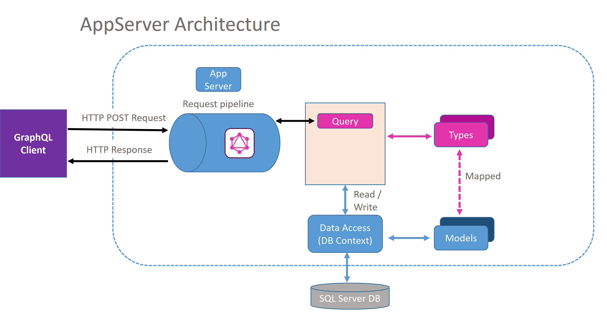
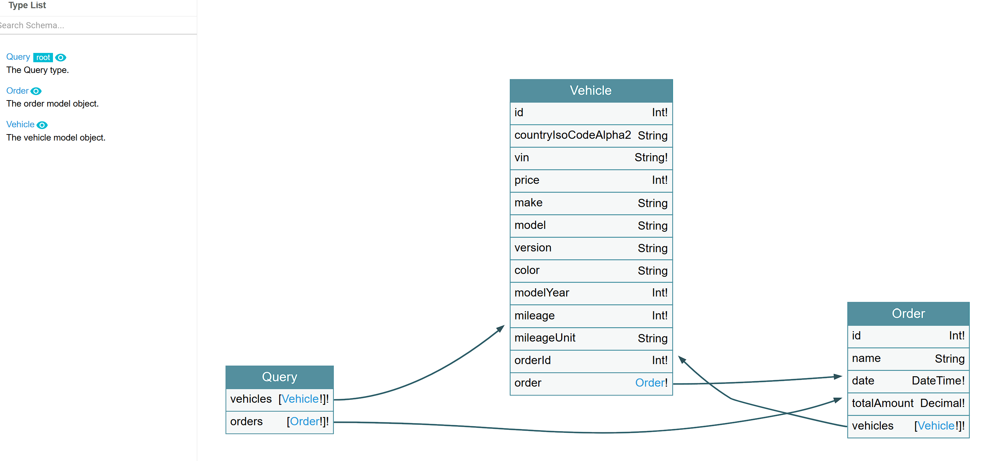

# HotChocolate-GraphQL
Creating a GraphQL .NET server with Hot Chocolate

## What is GraphQL?
- One Endpoint
- One Request
- Type System
- Predictable
- Realtime

## App server Architecture



## Interactive graph



## Tips

### Deferred execution
- HotChocolate is designed to work seamlessly with `IQueryable` and supports **deferred execution** out of the box.
  - When you return an IQueryable from a resolver, HotChocolate will take care of executing the IQueryable.
  - ensure that the query is only executed once and only when needed. (_abstracted away from the developer_)

### Resolver dependency injection
- Create target service + inject it by resolver when needed to support multiple parallel operations
- Pooled dbContext for faster data fetching, retrieve one **DbContext** instance from the pool for each invocation of a **resolver**. Once the resolver has finished executing, the instance will be returned to the **pool**.

### XML Documentation
- Out of the box, Hot Chocolate has the ability to automatically generate API documentation from your existing [XML documentation comments](https://learn.microsoft.com/en-us/dotnet/csharp/language-reference/xmldoc/recommended-tags).
Example:
```C#
/// <summary>
/// The vehicle model object.
/// </summary>
public class Vehicle
{
    /// <summary>
    /// The unique identifier.
    /// </summary>
    public required int Id { get; init; }

    /// <summary>
    /// The country ISO code ALPHA-2.
    /// </summary>
    public string? CountryIsoCodeAlpha2 { get; init; }
}
```

- you will need to enable documentation file generation for your `.csproj` through:
```C#
<PropertyGroup>
    <GenerateDocumentationFile>true</GenerateDocumentationFile>
    <NoWarn>$(NoWarn);1591</NoWarn>
</PropertyGroup>
```

- Otherwise you can provide documentation through [schema definition documentation](https://chillicream.com/docs/hotchocolate/v13/defining-a-schema/documentation).

## Local installation
- run `dotnet ef database update` to run db migrations.
- play with the API through [banana cake pop](https://eat.bananacakepop.com/): `http://localhost:5033/graphql/`.
- run the graph voyager through `http://localhost:5033/ui/voyager`.


## Resources
- [Official documentation.](https://chillicream.com/docs/hotchocolate/v13)
- [Resolver injection of a DbContext.](https://chillicream.com/docs/hotchocolate/v13/integrations/entity-framework#resolver-injection-of-a-dbcontext)
- [DbContext pooling.](https://learn.microsoft.com/en-us/ef/core/performance/advanced-performance-topics?tabs=with-di%2Cexpression-api-with-constant#dbcontext-pooling)
- [GraphQL voyager.](https://github.com/graphql-kit/graphql-voyager)